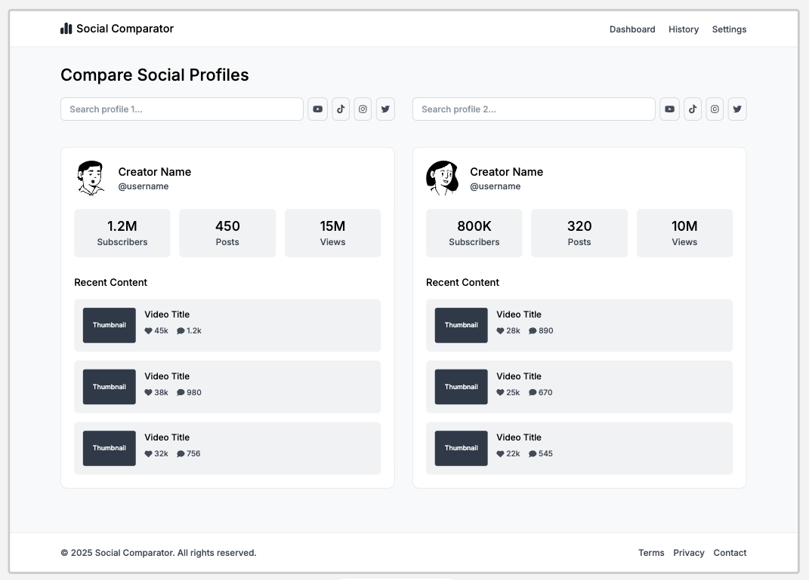

# YouTube Channel Comparator


[](./LICENSE)

This project is a complete example of how to build an SEO‑optimized, server‑side rendered application using **Angular v19**, **Angular Universal** and **Express** to consume the **YouTube Data API v3**. It lets you compare two YouTube channels side‑by‑side—showing subscribers, total videos, total views—and displays the latest 3 videos from each channel with their engagement metrics (likes & comments).

## Table of Contents

- [Technologies](#technologies)  
- [Features](#features)  
- [Wireframe](#wireframe)  
- [Usage](#usage)  
- [License](#license)  

## Technologies

- **Angular v19** & **Angular Universal** for SSR and SEO  
- **Express** as a “thin” backend to proxy and cache YouTube API requests  
- **YouTube Data API v3** for channel & video statistics  
- **Node.js** & **TypeScript**  
- **node-cache** (LRU) for in‑memory caching  
- **@angular/pwa** (optional) for PWA support  

## Features

- Autocomplete search for two YouTube channels  
- Side‑by‑side comparison of:
  - Subscriber count  
  - Total video count  
  - Total view count  
- Display of the latest 3 videos per channel, each with:
  - Thumbnail  
  - Title  
  - Like count  
  - Comment count  
- Server‑Side Rendering for full SEO support  
- Dynamic `<title>` and `<meta>` tags per comparison  
- Express‑level caching to minimize YouTube API quota usage  
- Responsive design & optional PWA offline support  

## Wireframe




## Usage

1. **Clone the repository**  
```bash
   git clone https://github.com/Fernanda-Kipper/social-media-comparer
   cd social-media-comparer
```

2. Configure your environment variables, using .env.example
3. Run the application

```bash
npm start
```

## License

### Educational Use License (EUL) 1.0

Copyright (c) 2025 Your Name

Permission is hereby granted, free of charge, to any person obtaining a copy of this software and associated documentation files (the “Software”), to use, copy, modify, and distribute the Software **solely for non‑commercial, educational, or personal study purposes** (“Permitted Purpose”), subject to the following conditions:

1. **Non‑Commercial Use Only**  
   The Software may **not** be used, sold, leased, sublicensed, or otherwise exploited for any commercial purpose or in any commercial product or service.

2. **Redistribution**  
   - Redistributions of source code must retain the above copyright notice, this list of conditions, and the full text of this License.  
   - Redistributions in binary form must reproduce the above copyright notice, this list of conditions, and the full text of this License in the documentation and/or other materials provided with the distribution.

3. **No Warranty**  
   THE SOFTWARE IS PROVIDED “AS IS”, WITHOUT WARRANTY OF ANY KIND, EXPRESS OR IMPLIED, INCLUDING BUT NOT LIMITED TO THE WARRANTIES OF MERCHANTABILITY, FITNESS FOR A PARTICULAR PURPOSE AND NONINFRINGEMENT. IN NO EVENT SHALL THE AUTHORS OR COPYRIGHT HOLDERS BE LIABLE FOR ANY CLAIM, DAMAGES OR OTHER LIABILITY, WHETHER IN AN ACTION OF CONTRACT, TORT OR OTHERWISE, ARISING FROM, OUT OF OR IN CONNECTION WITH THE SOFTWARE OR THE USE OR OTHER DEALINGS IN THE SOFTWARE.

4. **Liability**  
   In no event will the authors or copyright holders be held liable for any direct, indirect, incidental, special, exemplary, or consequential damages arising in any way out of the use of this Software.

5. **Termination**  
   This License and the rights granted hereunder will terminate automatically if you fail to comply with any of its terms. Upon termination, you must cease all use and distribution of the Software.

---

For the full text, see the [LICENSE](./LICENSE) file.  
